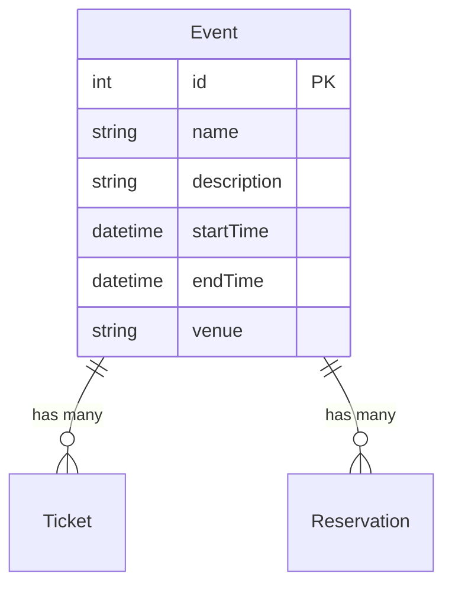
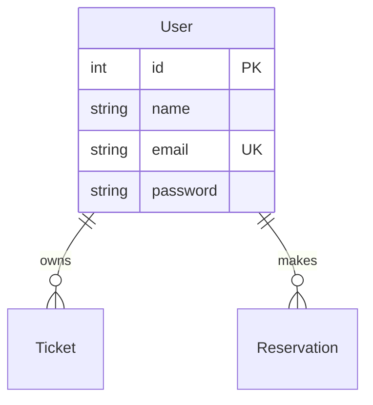
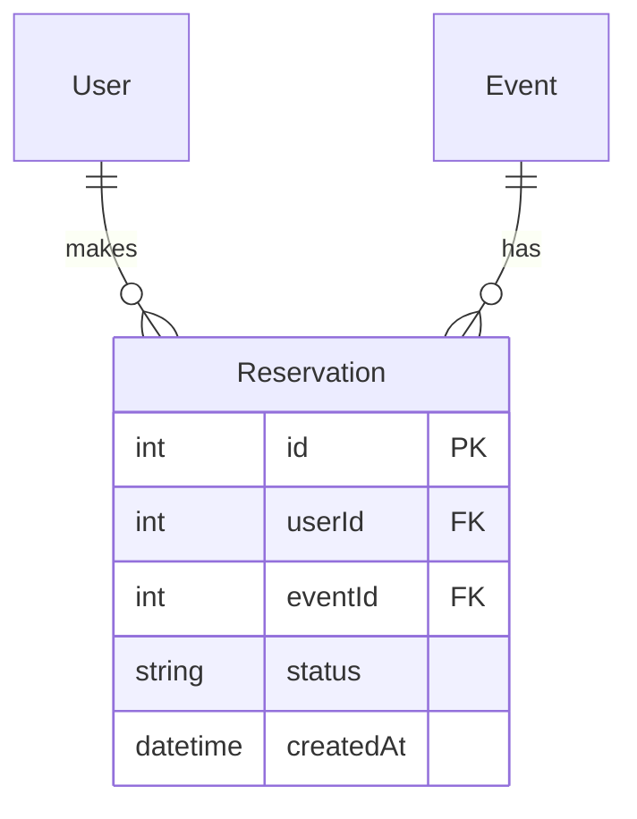
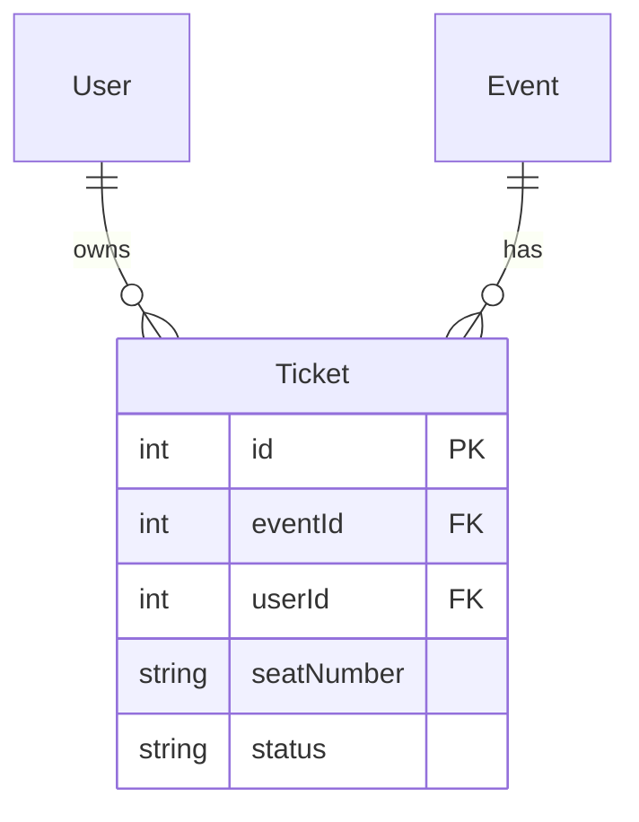

# Event Booking System Database Schema

## Overview

The database schema is designed to support an event booking system where users can reserve tickets for events. The system consists of four main entities: Events, Users, Reservations, and Tickets.

## Entity Relationships

### Event

The central entity representing an event that users can book.



**Fields:**

- `id`: Unique identifier
- `name`: Event name
- `description`: Optional event description
- `startTime`: Event start date/time
- `endTime`: Event end date/time
- `venue`: Location of the event

**Relationships:**

- One Event can have many Tickets
- One Event can have many Reservations

### User

Represents system users who can make reservations and hold tickets.



**Fields:**

- `id`: Unique identifier
- `name`: User's full name
- `email`: Unique email address
- `password`: Hashed password

**Relationships:**

- One User can have many Tickets
- One User can have many Reservations

### Reservation

Tracks event booking requests and their status.



**Fields:**

- `id`: Unique identifier
- `userId`: Reference to User
- `eventId`: Reference to Event
- `status`: Current status ("pending", "confirmed", "cancelled")
- `createdAt`: Timestamp of reservation creation

**Relationships:**

- Belongs to one User
- Belongs to one Event

### Ticket

Represents a confirmed seat for an event.



**Fields:**

- `id`: Unique identifier
- `eventId`: Reference to Event
- `userId`: Reference to User
- `seatNumber`: Assigned seat identifier
- `status`: Ticket status ("booked", "available")

**Relationships:**

- Belongs to one User
- Belongs to one Event

## Booking Flow

1. **Reservation Creation**

   - User selects an event
   - System creates a Reservation (status: "pending")
   - System holds the selected seats temporarily

2. **Ticket Generation**
   - Upon confirmation of reservation
   - System creates Ticket(s) with specific seat numbers
   - Reservation status updates to "confirmed"

## Common Queries

### Event Availability

```sql
SELECT
    e.*,
    COUNT(t.id) as booked_tickets
FROM Event e
LEFT JOIN Ticket t ON e.id = t.eventId
WHERE t.status = 'booked'
GROUP BY e.id;
```

### User Reservations

```sql
SELECT
    r.*,
    e.name as event_name,
    e.startTime
FROM Reservation r
JOIN Event e ON r.eventId = e.id
WHERE r.userId = :userId;
```

### User Tickets

```sql
SELECT
    t.*,
    e.name as event_name,
    e.startTime
FROM Ticket t
JOIN Event e ON t.eventId = e.id
WHERE t.userId = :userId;
```

```

This documentation provides:
1. Clear visualization of entity relationships
2. Detailed field descriptions
3. Explanation of the booking flow
4. Example queries for common operations

Would you like me to explain any specific part in more detail?
```
